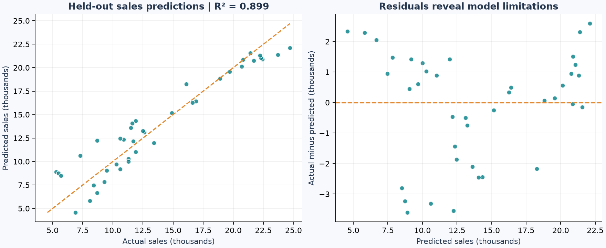

# Sales Prediction Model

**Python · scikit-learn · Linear Regression | Measured holdout performance**

How well can TV, radio and newspaper advertising spend predict market-level sales?
This project uses the ISL textbook Advertising benchmark, a simple linear model,
an untouched 20% holdout, and a training-mean baseline.



## Measured results

Data: **200 observations**, split into **160 training** and **40 test** rows with
`random_state=42`. Advertising spend is in thousands of dollars; sales are in
thousands of units. This is a cross-sectional textbook benchmark, not a time-series
forecast or a deployed business model.

| Held-out metric | Linear regression | Training-mean baseline |
|---|---:|---:|
| R² | 0.8994 | -0.0048 |
| MAE (thousand units) | 1.4608 | 4.9625 |
| RMSE (thousand units) | 1.7816 | 5.6315 |

Training-only five-fold cross-validation: mean R² **0.8703**,
sample standard deviation **0.0803**. Fold variability
is not a confidence interval. The held-out MAE is approximately **1,461 sales units**.

**R² = 0.8994 does not mean 89.94% prediction accuracy.** It compares squared
prediction error with the variation around the test-set mean. MAE and RMSE state
errors in the target's units. No classification accuracy is reported.

## Method and leakage prevention

1. Verify the source hash; require finite, nonnegative numeric feature/target values.
   Remove the CSV's row identifier from features. This snapshot has no missing or duplicate rows.
2. Fix the random 80/20 split before fitting or exploratory relationship charts.
3. Fit ordinary least squares with an intercept on TV, radio and newspaper spend.
4. Fit the mean-only baseline on the same training target values.
5. Run five-fold shuffled cross-validation **within the training partition only**.
6. Evaluate the already specified model and baseline on all 40 holdout rows.
   Save their row indices, individual predictions, residuals, coefficients and metrics.

No model selection is performed on the holdout, and no imputation or scaling is
needed for this complete dataset and unregularised linear model. No future date
prediction is claimed: the dataset provides no dates for a chronological split.

## Try a prediction

After setup (or using the committed training-fit model coefficients):

```bash
python -m src.model --predict 100 20 10
```

Inputs are TV, radio and newspaper spend, each in **$1,000s**. The command reports
predicted sales in **1,000 units** and flags inputs outside training ranges.
It uses portable JSON coefficients; there is no untrusted pickle to load.

## Evidence and interpretation

- [`metrics.json`](reports/metrics.json): holdout and cross-validation scores.
- [`test_predictions.csv`](reports/test_predictions.csv): every held-out prediction and residual.
- [`split.json`](reports/split.json): zero-based source data row indices, excluding CSV header.
- [`cross_validation.csv`](reports/cross_validation.csv): all five training-only fold scores.
- [`coefficients.csv`](reports/coefficients.csv) and [`model.json`](reports/model.json): fitted parameters.
- [`training_relationships.png`](reports/training_relationships.png): exploration restricted to training data.

The fitted coefficients are approximately 0.04473 (TV), 0.18920 (radio), and
0.00276 (newspaper), in thousand sales units per thousand advertising dollars,
conditional on the other predictors. These are associations, not incremental
return-on-investment estimates. The model substantially improves on the mean baseline,
but the residual plot shows that a single additive relationship misses some structure.

## Limitations and next investigation

Only 200 textbook observations are available; external business validity is unknown.
A random split assumes comparable observations rather than future market shifts.
Observational associations do not establish that changing spend changes sales.
The additive model omits interaction effects and diminishing returns. Predictions
can become implausible outside observed ranges. A useful next experiment is to compare
TV/radio interactions using training-only cross-validation, then evaluate on a new
untouched test set rather than repeatedly choosing models from this holdout.

## Data and attribution

Source: [ISL first-edition resources](https://www.statlearning.com/resources-first-edition),
`Advertising.csv`, distributed by the authors of *An Introduction to Statistical
Learning* (Gareth James, Daniela Witten, Trevor Hastie and Robert Tibshirani).
The exact URL and checksum are recorded in [`data/sources.json`](data/sources.json).
The dataset remains subject to its source terms; the raw CSV is not redistributed here.

## CV wording supported by this run

> Built and evaluated a scikit-learn linear regression model on 200 advertising
> observations; achieved held-out R² of 0.899 and MAE of 1.461 thousand sales units,
> with training-only cross-validation and a mean-prediction baseline.

## Run it locally

Use **Python 3.12**. From this repository's root:

```bash
python -m venv .venv
```

Activate it in Windows PowerShell with `.venv\Scripts\Activate.ps1`,
or on macOS/Linux with `source .venv/bin/activate`.
If PowerShell blocks activation, use `.venv\Scripts\python.exe` in place of `python`.

```bash
python -m pip install -r requirements.txt
python -m src.model
```

The first run downloads the public source files and checks their SHA-256 hashes.
Later runs use `data/raw/`. A changed source causes an explicit error rather than
silently changing the reported results. Delete a corrupted local cache file and retry;
if upstream bytes changed, review the data and update the manifest deliberately.

### Notebook and tests

```bash
python -m pip install -r requirements-dev.txt
python -m pytest -q
```

Open `notebooks/analysis.ipynb` in VS Code with the Jupyter extension and select
your `.venv` Python interpreter, or open it in an existing Jupyter installation.
The committed notebook contains executed outputs and can be viewed directly on GitHub.
It reruns the same pipeline, then explains its evidence. It works from the root or
the `notebooks` directory. No separate notebook-only implementation is maintained.

## Repository map

```text
src/                  Reusable analysis and command-line entry point
notebooks/            Executed, narrated walkthrough
data/sources.json     Exact source URLs, file sizes and SHA-256 hashes
reports/              Measured results, prediction tables and figures
tests/                Offline checks for data handling and metric integrity
.github/workflows/    Automated tests on push and pull request
requirements.txt      Exact versions of direct runtime dependencies
requirements-dev.txt  Runtime dependencies plus notebook and test tools
```

`reports/metrics.json` is the result of a real run, not a target or invented score.
`reports/run_metadata.json` records the execution time, Python and library versions,
and data provenance. Re-running updates generated reports. Direct dependencies are
pinned; transitive dependency resolution may differ on future installs.

## Scope and licensing

This is an educational portfolio project. Source code is provided under the MIT
license in `LICENSE`; that license does **not** relicense third-party datasets.
Raw source data are excluded from Git and from the downloadable repository archive.
